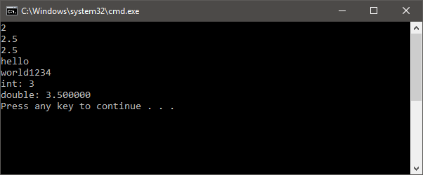

# Template Programming Exercise

A walthrough of special functions that take multiple types of arguments. The template specializations will figure out what to do based on the types.

Each commit is a step in the process of turning regular functions into template functions.

